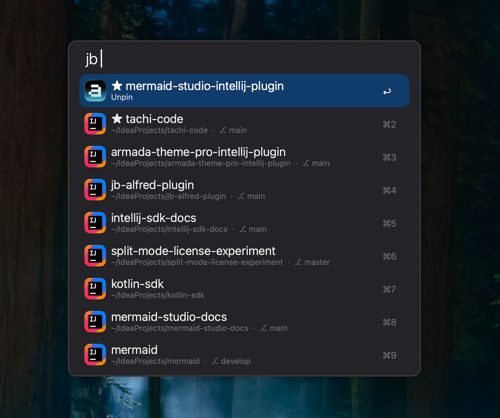
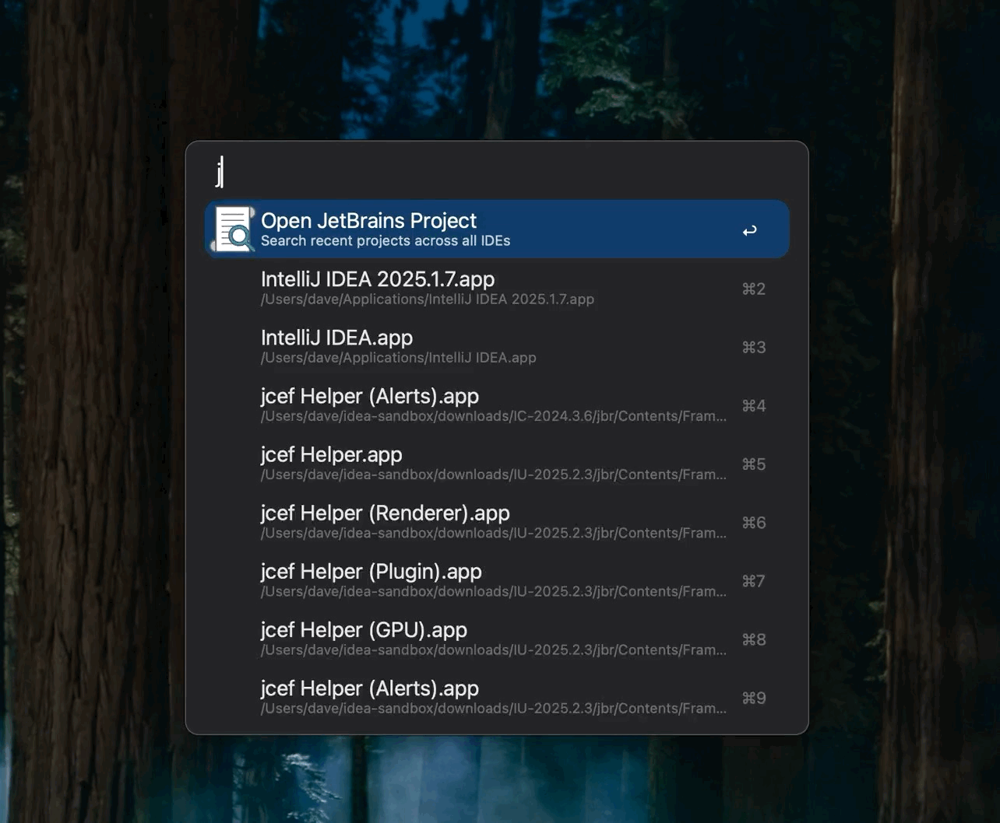
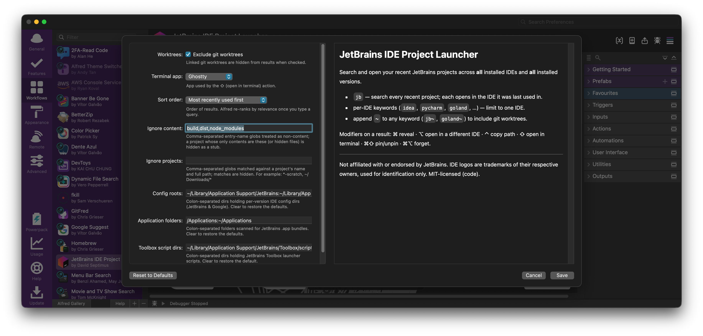
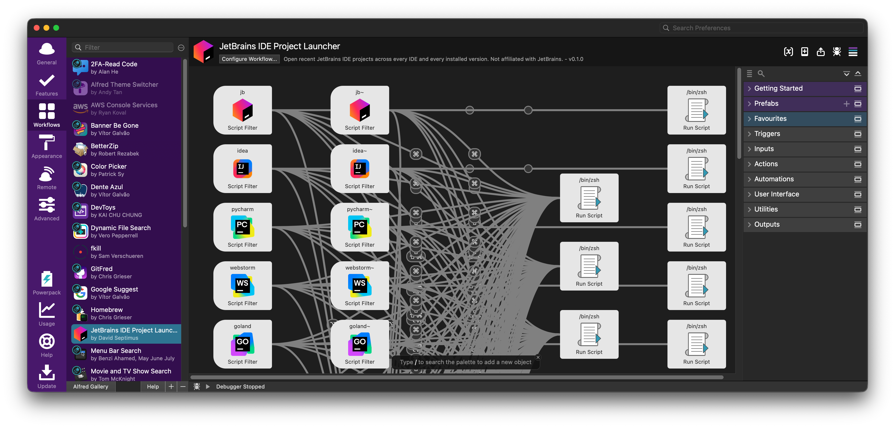

# JetBrains IDE Project Launcher

An [Alfred 5](https://www.alfredapp.com/) workflow that opens your recent
JetBrains projects — across **every installed IDE and every installed version**.

Most launchers read only the *newest* version directory of each IDE, so projects
you opened in an older version (or in anything other than your highest-numbered
install) silently disappear. JetBrains also caps each `recentProjects.xml` at
~50 entries. This workflow merges **all** of them, so your projects actually
show up.

> Not affiliated with, sponsored by, or endorsed by JetBrains. See
> [Trademarks](#trademarks--attribution).



---

## Features

- **Complete discovery** — merges `recentProjects.xml` from every version
  directory of every classic IDE, plus Android Studio, plus Fleet and Air
  workspaces, deduplicated by path and sorted by most-recently used.
- **Opens in the right IDE** — each project opens in the IDE it was last used in;
  if a different version of that IDE is already running, it reuses it.
- **Unified + per-IDE keywords** — `jb` for everything, or `idea` / `goland` /
  `pycharm` / … to scope to one IDE.
- **Quick actions** — reveal in Finder, copy path, open in a terminal, or pick a
  different IDE, all from modifier keys.
- **Tidy by default** — hides stale entries whose folder is gone, stub dirs with
  no visible files (only leftover `.idea`/`.git`/dotfiles), and linked git
  worktrees (with an opt-in to show them).
- **Pin & forget** — pin frequent projects to the top (★), or forget ones you
  don't want cluttering the list (reversible; never touches JetBrains' files).
- **Git branch** shown inline for projects in a git checkout.
- **Fast** — a single static Go binary with a mtime-keyed cache; no runtime
  dependencies.

---

## Requirements

- macOS, Alfred 5 with the **Powerpack**.
- One or more JetBrains IDEs (standalone or via JetBrains Toolbox).
- To build from source: Go 1.23+.

---

## Installation

### From a release

Download `jb-<version>.alfredworkflow` and double-click it to import.

macOS tags any browser download as quarantined, and Gatekeeper blocks the
workflow's (ad-hoc-signed) binary on first launch. The workflow clears its own
quarantine flag the first time you trigger it — from inside Alfred, no Terminal
step: Alfred runs the Script Filter through the system shell (which isn't gated),
so it strips the flag before launching the binary.

If the binary somehow stays blocked (results never appear), clear it by hand
once. Alfred imports each workflow into a randomly-named `user.workflow.<UUID>`
folder, so locate ours by its bundle id (stored in every workflow's `info.plist`)
and clear only that folder — never the whole workflows directory:

```sh
wf=$(grep -l com.davidseptimus.jetbrains-launcher \
  "$HOME/Library/Application Support/Alfred/Alfred.alfredpreferences/workflows"/*/info.plist | head -1)
[ -n "$wf" ] && /usr/bin/xattr -dr com.apple.quarantine "$(dirname "$wf")"
```

(`/usr/bin/xattr` is spelled out so a pyenv/conda `xattr` on your `PATH` — which
lacks `-r` — can't shadow the macOS built-in.)

### From source

```sh
git clone https://github.com/davidseptimus/alfred-jetbrains-launcher.git
cd alfred-jetbrains-launcher
make install      # build (arm64) + generate info.plist + stage icons + symlink into Alfred
```

`make install` symlinks the built bundle into Alfred's workflows directory, so
later `make build` runs are live immediately.

### Updating

When a newer release exists, an **"Update available" banner** appears at the top
of the `jb` results — **press ↩ on it to update in place** (your config, pins, and
forgotten projects are preserved). A background check runs about once a day, so
the banner shows up within a day of a release. The update downloads via the binary
(not a browser), so the new workflow isn't quarantined — it's seamless. (A
*manual* browser download of the `.alfredworkflow` is quarantined, but the
workflow clears that itself on first run, as described above.)

Self-update only applies to **released builds**. A build from source (`make
build`/`make install`) omits the update banner entirely — update it with
`git pull && make install` instead, so your working copy is never overwritten.
This is controlled by a build-time `channel` flag (`dev` by default; `make dist`
sets `release`).

---

## Usage

| Type                                                                                                                                                    | What you get                                                       |
|---------------------------------------------------------------------------------------------------------------------------------------------------------|--------------------------------------------------------------------|
| `jb <query>`                                                                                                                                            | All recent projects, each opening in its last-used IDE             |
| `idea`, `pycharm`, `webstorm`, `goland`, `clion`, `rubymine`, `datagrip`, `phpstorm`, `rider`, `rustrover`, `studio`, `dataspell`, `aqua`, `writerside` | Scoped to that IDE                                                 |
| `fleet`, `air`                                                                                                                                          | Scoped to Fleet / Air workspaces                                   |
| `<keyword>~`                                                                                                                                            | The same search, **including git worktrees** (`jb~`, `goland~`, …) |

Alfred fuzzy-matches your query against the project name and its path
components, so `jb webfoo` finds `~/work/web/foo`.

### Modifier keys (on a highlighted result)

| Key | Action                                                                       |
|-----|------------------------------------------------------------------------------|
| ↩   | Open in the resolved IDE                                                     |
| ⌘   | Reveal in Finder                                                             |
| ⌥   | Open in a different IDE (pick from installed)                                |
| ⌃   | Copy project path                                                            |
| ⇧   | Open in terminal (configurable app)                                          |
| ⌘⇧  | Pin / unpin (pinned float to the top, marked ★) — stays open, list refreshes |
| ⌘⌥  | Forget — hide from the launcher (stays open; `jb forget --clear` restores)   |

### Which IDE opens a project

1. The IDE recorded for that project (`productionCode`), in the **exact version**
   that last opened it, if installed.
2. The **newest installed version** of that same product.
3. **IntelliJ IDEA Ultimate** (latest), when the project type is first-class in
   IDEA (Java/Kotlin/web/Python/Go/PHP/DB/Ruby).
4. The newest installed IDE that fits — otherwise nothing (reveal / copy still
   work).

Then, if a *different* version of the resolved product is already running, the
project opens in that running version (rather than spawning another).

Per-IDE keywords hard-limit to their IDE; if that IDE isn't installed, they fall
back to the chain above and label the result accordingly.

#### Open in a different IDE

That resolution is only the default — press **⌥** on any result to override it and
pick from your installed IDEs:



---

## Configuration

Open **Configure Workflow…** in Alfred:



| Setting               | Variable               | Default                          | Effect                                                                                                                                   |
|-----------------------|------------------------|----------------------------------|------------------------------------------------------------------------------------------------------------------------------------------|
| Exclude git worktrees | `JB_EXCLUDE_WORKTREES` | on                               | Hide linked git worktrees (use `<keyword>~` to include per-search)                                                                       |
| Terminal app          | `JB_TERMINAL`          | Terminal                         | App for the ⇧ open-in-terminal action (iTerm, Warp, Ghostty, …)                                                                          |
| Sort order            | `JB_SORT`              | Most recent first                | Result order: recency / least-recent / name (A–Z, Z–A) / path. Alfred re-ranks by relevance once you type a query                        |
| Ignore content        | `JB_IGNORE_CONTENT`    | `build,dist,node_modules`        | Comma-separated entry-name globs treated as non-content. A project whose only contents are these (plus hidden files) is hidden as a stub |
| Ignore projects       | `JB_IGNORE_PROJECTS`   | _(none)_                         | Comma-separated globs matched against a project's name and full path; matches are hidden (e.g. `*-scratch`, `~/Downloads/*`)             |
| Config roots          | `JB_CONFIG_ROOTS`      | standard JetBrains & Google dirs | `:`-separated dirs holding per-version IDE config dirs                                                                                   |
| Application folders   | `JB_APP_ROOTS`         | `/Applications:~/Applications`   | `:`-separated folders scanned for JetBrains `.app` bundles                                                                               |
| Toolbox script dirs   | `JB_TOOLBOX_DIR`       | standard Toolbox scripts dir     | `:`-separated dirs of Toolbox launcher scripts                                                                                           |

The path fields are **pre-filled with their defaults**, so you can see and edit
the exact values; clear a field to restore its default. `jb doctor` prints the
resolved list.

### Keywords

Every keyword (`jb`, `idea`, …, `studio`, `air`) has its own field in the same
panel, so you can rename any that you like. This matters when a keyword is also a
word Alfred's default search matches: typing `studio`, for example, mixes your
projects with file/app hits for *Visual **Studio** Code* and other "studio"
files — rename it to something distinctive like `astudio` and it triggers
cleanly (its `~` worktree variant follows). Clear a field to disable that
keyword. These overrides live in the workflow's configuration, so they **persist
across updates** (editing the keyword node in the editor directly would be reset
on the next update).

---

## What's shown (and what isn't)

**Shown:** classic IDEs with a `recentProjects.xml` — IntelliJ IDEA (Ultimate &
Community), PyCharm (Pro & Community), WebStorm, GoLand, CLion, RubyMine,
DataGrip, PhpStorm, Rider, RustRover, DataSpell, Aqua, Writerside — plus Android
Studio, plus **Fleet** and **Air** (whose recent *workspaces* are read from their
`recent_ships.*.json` store; scratch sessions and remote/agent ships are skipped).

**Hidden:**

- Projects whose directory no longer exists on disk.
- Stub directories with no visible files (only hidden entries like `.idea` or
  `.git` remain — e.g. a removed worktree), and empty directories.
- Linked git worktrees, unless you use a `~` keyword or untick the setting.
- Remote-dev / devcontainer entries (detected and skipped).

**Not yet supported:** JetBrains Gateway (remote development), AppCode
(discontinued by JetBrains in 2022), and the legacy pre-2019 `recentPaths` XML
schema.

## Supported versions

Discovery reads the modern `recentProjects.xml` schema (the `additionalInfo` →
`RecentProjectMetaInfo` map), which is what JetBrains IDEs **2019.1+** and Android
Studio **3.x+** write — there is no per-IDE version list to maintain; whatever
version directories exist on disk are read. Older IDEs used the legacy
`recentPaths`/`<list>` schema, which is detected and skipped (those entries
simply won't appear). Fleet and Air are read from their `recent_ships.*.json`
workspace store instead of XML.

---

## Verifying without Alfred

The binary speaks Alfred Script Filter JSON on stdout:

```sh
./build/jb-bundle/jb search | jq '.items | length'
./build/jb-bundle/jb search --product goland | jq '.items[].title'
./build/jb-bundle/jb search --worktrees | jq '.items | length'
./build/jb-bundle/jb refresh         # rebuild the cache
./build/jb-bundle/jb doctor          # diagnostics: detected IDEs, roots, why things are hidden
```

---

## Development

The non-obvious control flows — project discovery, IDE resolution, the cached
update check, and the first-run quarantine self-heal — are diagrammed in
[docs/ARCHITECTURE.md](docs/ARCHITECTURE.md).

```
cmd/jb            workflow backend: search / ides / open / action / refresh
cmd/genplist      generates info.plist + per-object canvas icons from workflow/ides.json
internal/discover find every recent file across all version dirs
internal/recent   parse + merge/dedupe (worktree, .idea-only, existence checks)
internal/ide      product catalogue, installed-IDE detection, resolution, running check
internal/launch   open / reveal / copy / terminal
internal/alfred   Script Filter JSON
internal/cache    mtime-keyed cache of the merged list
workflow/ides.json  the IDE/keyword table that drives the generated plist
assets/icons      vendored fallback IDE icons; assets/icon.png is the workflow icon
```

| Target                                    | Does                                                                                            |
|-------------------------------------------|-------------------------------------------------------------------------------------------------|
| `make build`                              | arm64 binary into the bundle (fast dev)                                                         |
| `make build-universal`                    | fat arm64+amd64 binary (releases)                                                               |
| `make plist`                              | regenerate `info.plist` + per-object icons                                                      |
| `make icons`                              | stage the vendored fallback icons into the bundle                                               |
| `make bundle`                             | assemble + ad-hoc codesign + de-quarantine                                                      |
| `make install`                            | symlink the bundle into Alfred                                                                  |
| `make dist`                               | package `dist/jb-<version>.alfredworkflow`                                                      |
| `make test` / `make vet`                  | `go test ./...` / `go vet ./...`                                                                |
| `make wipe-update-cache`                  | delete the cached release check so `jb` re-checks now (keeps pins/forgets)                       |

`info.plist` is **generated** (deterministic UUIDv5 UIDs) — edit
`workflow/ides.json`, not the plist.

### Cutting a release

Releases are cut entirely by GitHub Actions — there's no local release step.
In the repo, go to **Actions → release → Run workflow** and choose the bump
(`patch` / `minor` / `major`). The job derives the next version from the latest
`v*` tag, builds the universal `.alfredworkflow`, commits the `VERSION` bump,
tags it, and publishes the GitHub Release (which the in-app update banner then
surfaces). With no tags yet, `minor` cuts `v0.1.0`.



---

## Trademarks & attribution

This is an independent, community-built workflow and is **not affiliated with,
sponsored by, or endorsed by JetBrains s.r.o.**

The bundled IDE logos are JetBrains product logos and the JetBrains Toolbox logo
(© JetBrains s.r.o.), used for identification only in accordance with the
[JetBrains Website Terms of Use](https://www.jetbrains.com/legal/docs/company/useterms/)
and [Brand Guidelines](https://www.jetbrains.com/company/brand/). Icons for IDEs
you have installed — including Android Studio, Fleet, and Air — are drawn by
macOS from the application itself and aren't bundled. See
[THIRD-PARTY-NOTICES.md](THIRD-PARTY-NOTICES.md).

Inspired by [bchatard/alfred-jetbrains](https://github.com/bchatard/alfred-jetbrains).

---

## AI-generated code

This workflow was written by Claude Code with human oversight and testing.

---

## License

[MIT](LICENSE) — applies to the source code only. The bundled logos are not
covered by the MIT license; see [THIRD-PARTY-NOTICES.md](THIRD-PARTY-NOTICES.md).
