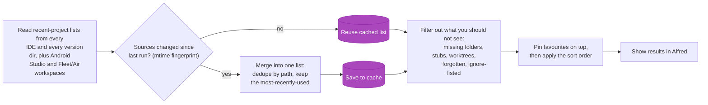
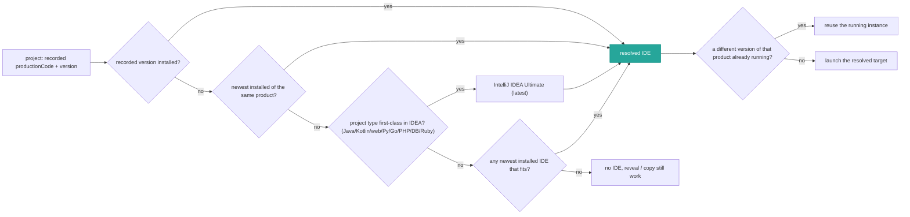
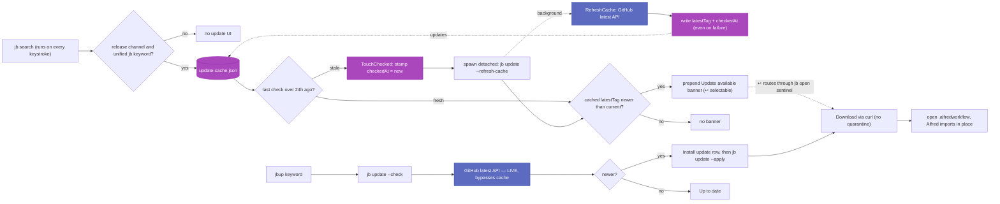
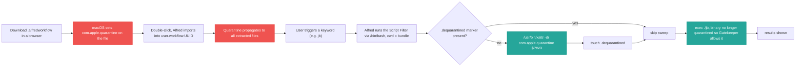

# Architecture & key flows

Diagrams of the non-obvious control flows behind the workflow. Each renders on
GitHub directly from the ```mermaid blocks below.

- [Project discovery → merge → display](#project-discovery--merge--display)
- [IDE resolution](#ide-resolution)
- [Update check (cached banner vs live `jbup`)](#update-check-cached-banner-vs-live-jbup)
- [First-run quarantine self-heal](#first-run-quarantine-self-heal)

---

## Project discovery → merge → display

Every `jb search` builds (or reuses) the merged project list. The cache key is an
mtime fingerprint, so a newly-created IDE version dir invalidates it — that's what
prevents the "only the newest version is read" bug this workflow exists to fix.



Code: `internal/discover`, `internal/recent` (merge/dedupe), `internal/cache`
(mtime fingerprint), `cmd/jb` `loadProjects` / `emitSearch`.

---

## IDE resolution

Which IDE opens a project, then which *instance*. The chain falls back from the
exact recorded version down to "any IDE that fits", and finally reuses an
already-running instance of the resolved product rather than spawning another.



Code: `internal/ide` (`Resolve`, `NewestByFamily`, `PreferRunning`), `cmd/jb`
`cmdOpen`.

---

## Update check (cached banner vs live `jbup`)

Two surfaces, deliberately different. The passive "update available" banner on
`jb` is driven entirely by a **cached** check (no network on the hot path), with a
background refresh at most once a day; the banner is **selectable** — pressing ↩
runs the update in place. Typing **`jbup`** instead hits GitHub **live**, so it's
always current. Self-update downloads via curl — not a browser — so the upgrade is
never quarantined.



The `TouchChecked` stamp is the debounce: Alfred re-runs the Script Filter on
every keystroke, so stamping `checkedAt = now` *before* spawning means only one
background refresh fires per 24h window instead of one per keystroke. A failed
refresh still records `checkedAt`, so a transient outage doesn't cause constant
retries (it waits the full window). The banner has no downstream wiring of its own
— Alfred routes one connection per Script Filter — so its ↩ reuses the `jb open`
action via a sentinel `arg` that `cmdOpen` recognises and turns into an update.
Code: `internal/update`, `cmd/jb` `updateBanner` / `spawnBackgroundRefresh` /
`cmdUpdate` / `cmdOpen`.

---

## First-run quarantine self-heal

A browser-downloaded release is quarantined, and macOS Gatekeeper blocks the
ad-hoc-signed binary on first launch. The fix lives in the Script Filter shell,
not the binary (see the note below).



**Why the shell, not the binary:** a direct exec of the quarantined binary is
killed by Gatekeeper *before* `main()` runs, so the binary can never clear its own
flag — a chicken-and-egg. Alfred's inline Script Filter runs under `/bin/bash` (a
system binary, not gated) using `/usr/bin/xattr` (also system), so it strips the
flag first, then launches the now-clean binary. The sweep is scoped to `"$PWD"`
(our own bundle, never a sibling workflow) and guarded by a `.dequarantined`
marker so it runs once per install; Alfred wipes the marker when it re-imports an
upgrade, so a re-downloaded (and thus re-quarantined) build is cleaned again.
Code: `dequarantinePrefix` in `cmd/genplist/main.go`.
