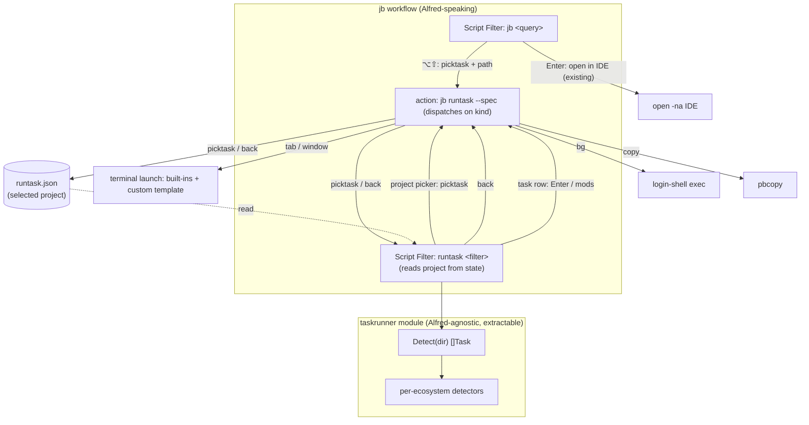

# Task Runner — design note

Status: **planned (v1 not yet implemented)**. This captures the agreed design so
it survives across sessions. Companion to the deferred-decision record in the
agent memory (`runconfig-execution-deferred`, `task-runner-plan`).

## Goal

From a project surfaced by `jb`, drill into the project's **build-system tasks**
(npm scripts, Make targets, justfile recipes, Taskfile tasks, Gradle/Maven verbs)
and launch one in a terminal — each task in its own terminal tab/window so several
can run in parallel.

This deliberately sidesteps the dead end we hit with JetBrains *run
configurations*: there is no external hook to fire a named run config (see
`runconfig-execution-deferred`). Build-system task detection + terminal launch is
strictly more general (works for any project, JetBrains or not) and fully
tractable.

## Why not the IDE run configs

JetBrains exposes no CLI/URL/headless way to trigger a named run configuration;
only build-tool-backed configs are externally reconstructable, and JVM
`Application`/test configs need the IDE's classpath/JDK/agents. So we detect tasks
from build-system files on disk instead — the same on-disk-detection the workflow
already does well.

## Architecture



### Module layout (extractable from day one)

- New module at `./taskrunner/go.mod`, **independent module path**
  (`github.com/davidseptimus/alfred-taskrunner`) even though it lives in this repo,
  so a future extraction is a `git mv` with zero import churn.
- Root `go.work` (`use .` + `use ./taskrunner`) for atomic local dev.
- jb's `go.mod`: `require` it + `replace … => ./taskrunner` so release builds work
  from the monorepo with no publishing. On extraction: drop the `replace`, require
  a tag.

### Core API (Alfred-agnostic — the load-bearing boundary)

```go
package taskrunner

type Runner string // npm|pnpm|yarn|bun|make|just|task|gradle|maven

type Task struct {
    Name     string   // "dev", "runIde"
    Runner   Runner
    Command  []string // resolved argv: ["npm","run","dev"], ["./gradlew","runIde"]
    Cwd      string
    Source   string   // "package.json" — subtitle / disambiguation
    Runnable bool     // underlying tool present on PATH (drives Alfred `valid`)
}

func Detect(dir string, opts Options) ([]Task, error)

type Options struct {
    Disabled []Runner // runners to skip entirely (from JB_TASK_DISABLE)
}
```

No Alfred types, no terminal logic here. The wrapper maps `Task -> Alfred Item`
and `Task -> terminal launch`.

**Name collisions** (same task name from two runners, e.g. `build` in both a
`Makefile` and `package.json`) are **not** deduped — they're genuinely different
commands. We show both rows disambiguated by `Source`, ordered by runner
precedence. (This is why we drop tk's `runner2` field: that collapse-to-one only
matters for a typed CLI, not a visual picker.)

**Disabling runners.** `Detect` skips any runner in `opts.Disabled` *before*
running its detector, so a disabled runner costs nothing — notably lets a user
turn off Gradle's slow enumeration. Sourced from `JB_TASK_DISABLE`.

## Detection — using `task-keeper` (tk) as the reference

Reference clone at `~/IdeaProjects/task-keeper` (binary-only Rust crate — read for
algorithm, not consumed as a dependency). tk splits detection into **runners**
(files defining named tasks) and **managers** (build tools with canonical verbs).
We port the *approach*, not the code.

| Ecosystem | Source | Approach (per tk) | Notes for our port |
|---|---|---|---|
| npm/pnpm/yarn/bun | `package.json` | parse `.scripts`, **drop `pre`/`post`** | pm from `packageManager` field → lockfile (`bun.lock*`/`pnpm-lock.yaml`/`yarn.lock`) → npm. Run `<pm> run <task>` |
| make | `Makefile` | parse targets `^[A-Za-z0-9][\w.-]*:`, drop `.PHONY`; fallback `make -pRrq` | static parse on drill-in |
| just | `justfile` | shell out `just --dump --dump-format=json` | gets modules (`mod::name`)/docs; needs `just` on PATH |
| task | `Taskfile.yml` | shell out `task --list-all`, parse `^\* name:`; handle `(aliases:)` | needs `task`/`go-task` on PATH |
| composer | `composer.json` | parse `scripts`, drop `pre-`/`post-` | `composer run-script <x>` |
| deno | `deno.json[c]` | parse `tasks` (string or `{command}`); string-aware JSONC comment strip | `deno task <x>` |
| rake | `Rakefile` | shell out `rake -T`, parse `rake name # desc` | needs `rake` on PATH |
| gradle | `build.gradle[.kts]` | **live enumerate** grouped tasks via `./gradlew tasks` (cached, progressive); fixed verbs as instant first-paint / fallback | prefer `./gradlew`; sniff *highlights* run task (`runIde`/`bootRun`) at top |
| maven | `pom.xml` | **fixed canonical verb map**; sniff pom for `start` | prefer `./mvnw` — Maven has no clean "list goals" |
| cargo | `Cargo.toml` | fixed verbs (`build`/`test`/`check`/`clippy`/`fmt`/…) | `run` gated on `src/main.rs` |
| go | `go.mod` | fixed verbs (`build`/`test`/`vet`/`tidy`) | `run` gated on `main.go` |
| dotnet | `*.sln`/`*.csproj` | fixed verbs (`build`/`run`/`test`/`publish`/…) | solution preferred over project |

### Gradle: live enumeration (decision — deviates from tk)

tk uses a fixed verb map for Gradle, deliberately discarding custom tasks. We
**reject that for Gradle** because real Gradle projects carry the tasks our users
actually want — `runIde`, `buildPlugin`, `runPluginVerifier`, code-gen, release
pipelines. So Gradle **enumerates**:

- **Primary:** `./gradlew tasks --console=plain`, parse grouped output
  (`name - description` under group headers). Default to **grouped/public** tasks
  (where authored tasks like `runIde` live), not `--all` (which floods with
  `:sub:compileTestJava` noise). `--all` behind a "show all tasks" toggle.
- **Slow → cache hard.** Enumeration costs seconds (daemon + configuration). Cache
  keyed on a build-input fingerprint (`settings.gradle[.kts]`, module
  `build.gradle[.kts]`, `gradle.properties`, `gradle/libs.versions.toml`,
  `buildSrc/`) + a TTL backstop (default ~24h, configurable) for plugin/dependency-
  driven changes that don't touch those files + a manual **↻ rescan** row.
  **Refresh = fingerprint change ∨ TTL elapsed ∨ manual rescan.**
- **Progressive first-paint** (on-brand with jb's background-cache-refresh): on a
  cold drill-in show the fixed verbs + sniffed run task instantly, spawn
  `./gradlew tasks` in the background to fill the cache; next drill-in shows the
  full list. If enumeration fails (offline, broken build) degrade to fixed verbs.
- **Live refresh + progress (implemented).** A background enumeration is tracked
  by a `.spawning` sidecar marker next to the cache. While it's present the task
  list shows a *Refreshing Gradle tasks…* row and emits Alfred's top-level
  `rerun` (0.7s), so the keyword re-polls itself and swaps in the fresh list the
  moment the cache lands — no retype. The manual **↻ Refresh tasks** row (a
  `refresh<US>path` spec) doesn't block: it kicks the background enumeration and
  reopens straight into that polling state, so Alfred never hangs on the slow
  `./gradlew tasks`.
- **Failure handling.** On a failed/empty enumeration the worker drops the
  `.spawning` marker and writes a `.error` sidecar. The task list then shows a
  *Gradle task refresh failed — showing default tasks* row (over the fixed verbs)
  and stops polling. The `.error` marker also **cools down** auto-respawns, so a
  broken build can't tight-loop `gradlew` on every keystroke; a manual ↻ refresh
  clears it to force an immediate retry. Both markers share one freshness lease
  (`gradleEnumLease`, ~90s) sized to cover a slow cold enumeration, so a crashed
  worker's leftover marker can't wedge the spinner or the cooldown forever.
- **Sniff is a highlighter, not the list:** `org.jetbrains.intellij[.platform]` →
  pin `runIde`; Spring → pin `bootRun`. The real task still appears via enumeration.

### Maven: fixed verbs (no enumeration)

Maven goals are plugin-defined with no clean enumeration, so the fixed canonical
verb map stays (`build`/`test`/`start`/`clean`/`deps`/`doc`/`update`…), with the
pom sniff specializing `start`: `spring-boot-starter-web[flux]` → `spring-boot:run`;
Quarkus → `quarkus:dev`; else `exec:java`. Static — never needs refreshing.

### Runnable vs detected

Port tk's `is_available()` (file exists) vs `is_command_available()` (tool on
PATH) split. We detect a task even when its tool is absent, but set
`Runnable=false` → Alfred `valid=false` + a "install <tool>" hint, rather than
hiding it.

### Caching

Reuse jb's mtime-fingerprint cache for runner detection (keyed on the relevant
task-file mtimes per project dir). Maven's fixed list is static (no cache).
**Gradle enumeration is cached** (build-input fingerprint + TTL + manual rescan,
above) since it's the one slow detector.

## Wrapper wiring — the `runtask` keyword (standalone, two-level)

Tasks live in their **own keyword**, `runtask` (configurable via `JB_KW_RUNTASK`),
*not* a nested drill off `jb`. This was forced by the need to **filter** at the
task level: a Script Filter filters by its query, so the selected project can't be
in the query — it lives in **state** instead, leaving the query free to filter.
(Earlier attempts failed here: a keyword-less drill puts the project path in the
query, so `filterResults` either hides every task or can't filter at all; and the
`jb_proj_path` variable trick broke because `alfred.Mod.Arg` is `omitempty`, so an
empty arg fell back to the item's path.)

`runtask` is **two levels, both natively filterable**:

1. **Project picker** — `./jb tasks --runtask` with no target lists projects (the
   same visible set as `jb`). Each row's arg is `picktask<US><path><US><variant>`.
2. **Task list** — once a project is in state, the same keyword lists that
   project's tasks, preceded by a `back` row (arg `back`) to return to the picker.

### `+` / `~` picker variants (parity with the `jb` keyword)

The picker takes the same modifiers as `jb`, so the *project* step has the same
three views the launcher does — they share one predicate (`projectInVariant`) so
the two keywords can never disagree on which projects a variant surfaces:

- **`runtask`** — IDE recents only (the plain list).
- **`runtask+`** (`--roots`) — recents **+** projects discovered by scanning
  your project roots (mirrors `jb+`).
- **`runtask~`** (`--worktrees`) — the git-**worktree**-only list (mirrors `jb~`),
  ⑂-marked.

Each is its own Script Filter (`{var:JB_KW_RUNTASK}` + `+`/`~`, like the `jb`
variants), all wired to the one launch action with the same row mods. They differ
only in the candidate set their picker emits.

**Variant semantics — they always open the picker.** Plain `runtask` is
state-respecting (a saved project ⇒ its task list). The `+`/`~` variants are an
explicit "I'm looking for a (different) project" gesture, so they **bypass the
saved target and always show the widened picker** — but never *clear* it, so
dismissing a variant picker leaves your prior scope intact.

**The variant is persisted** (`runtask.json` gains a `variant` field). When you
pick a project, the launch action records both the path and the variant it came
from, then reopens the **plain** keyword (which lands on that project's tasks —
reopening the variant keyword would just bounce back to the forced picker).
Later, **⬅ Switch project** (`back`) drops the path but keeps the variant and
reopens `runtask<variant>`, returning you to the same widened picker rather than
plain recents. The `jb`/`jb+`/`jb~` ⌥⇧ fast lane carries the matching variant in
its `picktask` spec, so a task picked from `jb~` likewise *backs* into `runtask~`.

State + navigation:

- Selected project is held in `<DataDir>/runtask.json`. The launch action writes
  it and re-opens Alfred on the `runtask` keyword (the proven `reopenAlfred` +
  osascript pattern pin/forget use), so the keyword re-reads state and shows the
  next level.
- **One launch action** handles every row: `./jb runtask --spec "$1"` dispatches on
  the leading *kind* token — `picktask` (set target + reopen), `back` (clear +
  reopen), `refresh` (kick a background Gradle re-enumeration + reopen into the
  polling state), or a launch kind. So `Enter` and the launch modifiers all route
  to the one action; no Conditional. Project rows disable the launch modifiers.
- **`jb` fast lane:** ⌥⇧ on a `jb` project row carries a `picktask<US><path>` arg to
  the same launch action — recording that project and jumping straight into its
  tasks. `Enter` on a `jb` row still opens the IDE; the fast lane is additive.
  (⌥⇧, not ⌘⌃ — macOS reserves ⌘⌃ for system chords.)

Subcommands: `jb tasks --runtask` (emit the active level), `jb tasks --path <p>
--enumerate-gradle` (background Gradle-cache refresh), `jb runtask --spec <…>`
(navigate/launch). Each task row encodes its resolved command per modifier in its
arg, so launching needs no re-detection.

- **Launch matrix (modifiers on a task row):**

  | Key | Launch | Mechanism |
  |---|---|---|
  | `Enter` | new terminal **tab** | terminal built-in / template, `tab` verb |
  | `⌘Enter` | new terminal **window** | `window` verb |
  | `⌥Enter` | **background** + notify | login-shell exec (reuses `OpenCommand`) |
  | `⌃Enter` | **copy** resolved command | `pbcopy` (reuses `CopyPath`) |

  New tab is the default because each task gets its own OS-level session →
  parallel runs, independent output/scrollback/kill, with the terminal acting as
  the process manager (we deliberately build no supervision; repeat launches
  duplicate tabs, by design).

## Terminal launch

- **Built-ins: Terminal.app, iTerm2, Ghostty.** Terminal.app/iTerm2 use AppleScript
  for `tab`/`window`. Ghostty has no scriptable API: its `window` uses
  `open -na Ghostty --args -e <shell> -lc …` (re-execs a login shell so it stays
  open); its `tab` drives the ⌘T `new_tab` keybind via System Events and types the
  command (needs Accessibility, like the Terminal.app tab path). kitty/WezTerm/Warp
  go through the custom template.
- **Custom template** escape hatch like `OpenCmd` (`JB_TASK_TERMINAL_CMD`): tokens
  `{cmd}` (raw command), `{cwd}`/`{name}` (`shellQuote`-spliced); the template runs
  via the login shell — which under Alfred has a **minimal PATH** (no
  `/opt/homebrew/bin`). Two consequences the examples must handle: (1) launch the
  terminal via `open -na <App>.app` (found by Launch Services regardless of PATH) —
  a bare `wezterm`/`kitty` binary name fails with `exit status 127`; (2) make the
  task **source the user's shell rc** so its `~/.zshrc` PATH (asdf/nvm/pyenv) loads,
  else tasks fail with `command not found`. Verified config-UI examples:
  `open -na kitty.app --args --hold -d {cwd} /bin/zsh -lc "source ~/.zshrc; {cmd}"`,
  `open -na WezTerm.app --args start --cwd {cwd} -- /bin/zsh -lc "source ~/.zshrc; {cmd}; exec /bin/zsh -il"`.
  Notes: `-lc` (non-interactive) runs the task — `-ilc` loads the rc too but a
  directly-`exec`'d interactive shell trips `zsh: can't set tty pgrp` warnings.
  Keep-open differs per terminal: kitty has a native `--hold`; WezTerm has no hold
  flag, so the trailing `exec /bin/zsh -il` keeps the window open *and* makes that
  interactive shell the foreground process (clean job control). The `exec` trick
  does *not* hold a kitty window open — hence `--hold` there. Avoid
  `kitty @ launch` / `wezterm cli spawn`: they need remote control / a running
  instance and exec the command with no shell, so no rc files are sourced.
- **Terminal.app tabs:** uses the System Events ⌘T route → a one-time macOS
  Accessibility permission prompt (accepted tradeoff; document so it doesn't read
  as a bug). Other terminals get native tabs without a prompt.
- `bg`/`copy` kinds are terminal-agnostic.

## Icons

- The `runtask` keyword uses the IntelliJ **run/execute** arrow. The project
  picker shows each project's live IDE icon (Alfred `fileicon`); task rows show a
  **per-runner** icon (`icons/<runner>.png` → fallback `run` → `default`).
- Task icons are JetBrains-themed, produced by `scripts/gen-task-icons.sh`: run,
  npm, gradle, maven are extracted from the installed **IntelliJ IDEA** (Apache-2.0);
  go, cargo, composer (PHP mark), rake (Ruby mark), and dotnet are pulled from the
  **IntelliJ Icons catalog** (intellij-icons.jetbrains.design) since those product
  IDEs aren't installed. Runners with no catalog/IDE icon (make, just, go-task,
  deno) fall back to the run arrow. See `THIRD-PARTY-NOTICES.md`. Drop a same-named
  PNG into `assets/icons/` to override any.

## Config additions

- `JB_TASK_TERMINAL` — built-in terminal name (default `Terminal`; `iTerm`/`Ghostty`).
- `JB_TASK_TERMINAL_CMD` — custom launch template; overrides the built-in.
- `JB_TASK_WINDOW` — when set, ↩ defaults to a new **window** (⌘↩ then does a tab);
  swaps the default launch view. Default off = tab.
- `JB_TASK_DISABLE` — comma-separated runners to disable
  (`npm,make,just,task,gradle,maven`); default empty = all enabled. Checked before
  each detector runs, so disabling is also a perf lever (e.g. skip Gradle
  enumeration). (Denylist by default; an allowlist form can come later if needed.)

## Decisions locked

- Surface: **standalone `runtask` keyword**, two levels (project picker → tasks),
  both natively filterable via project-in-state. ⌥⇧ on a `jb` row is a fast lane
  into it. (Superseded the earlier keyword-less ⌥⇧ drill, which couldn't filter
  the task list.) Already the decoupled, extractable surface.
- Terminal.app: do the **accessibility ⌘T hack** for real tabs.
- **Gradle: live-enumerate grouped tasks** (`./gradlew tasks`), cached
  (fingerprint + TTL + manual rescan), progressive first-paint, sniff highlights
  the run task. **Maven: fixed canonical verbs** (no clean enumeration).
- Ecosystems v1: package.json, Makefile, justfile, Taskfile.yml, Gradle, Maven.

## Deferred / future

- Standalone workflow extraction (own bundle/Gallery listing) once validated; the
  module boundary makes it cheap. Needs its own project-source story.
- More ecosystems from tk's list (cargo, deno, composer, poetry/uv, Procfile…).
- Gradle `--all` task graph toggle (beyond the grouped/public default).
